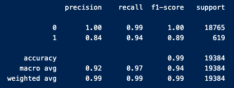

# credit-risk-classification
Module 20 Challenge

This project utilizes supervised machine learning to analize credit risk factors and predict loan health.

## Files
- credit_risk_classification.ipynb
- report.md
- Resources/lending_data.csv
- images/*.png (for this readme file)

## Highlights
- Logistic Model applied to:
    * loan size
    * interest rate
    * borrower income
    * debt to income rate
    * total debt
    * number of loans
    * derogatory marks
    
- Model Report:

## Acknowlegements
- This project was created as part of the EdX Data Analytics Bootcamp

## Author
Andrew Lane, 2025 
[@andrewplane](https://github.com/andrewplane)